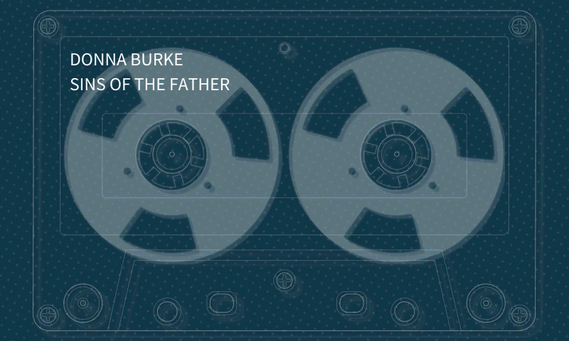

MGSV: TPP ui tape.

https://www.youtube.com/watch?v=XBrV5XuICK0&t=25s



## Install

Download: https://github.com/unknown321/tpp-wampy/releases/latest

Unzip into `wampy/skins/cassette`


### Build

Source is `texture0/Assets/tpp/ui/ModelAsset/mb_cassette/Pictures`. MGSV_QAR_Tool -> FtexTool -> Gimp.

```shell
make clean run release
```
